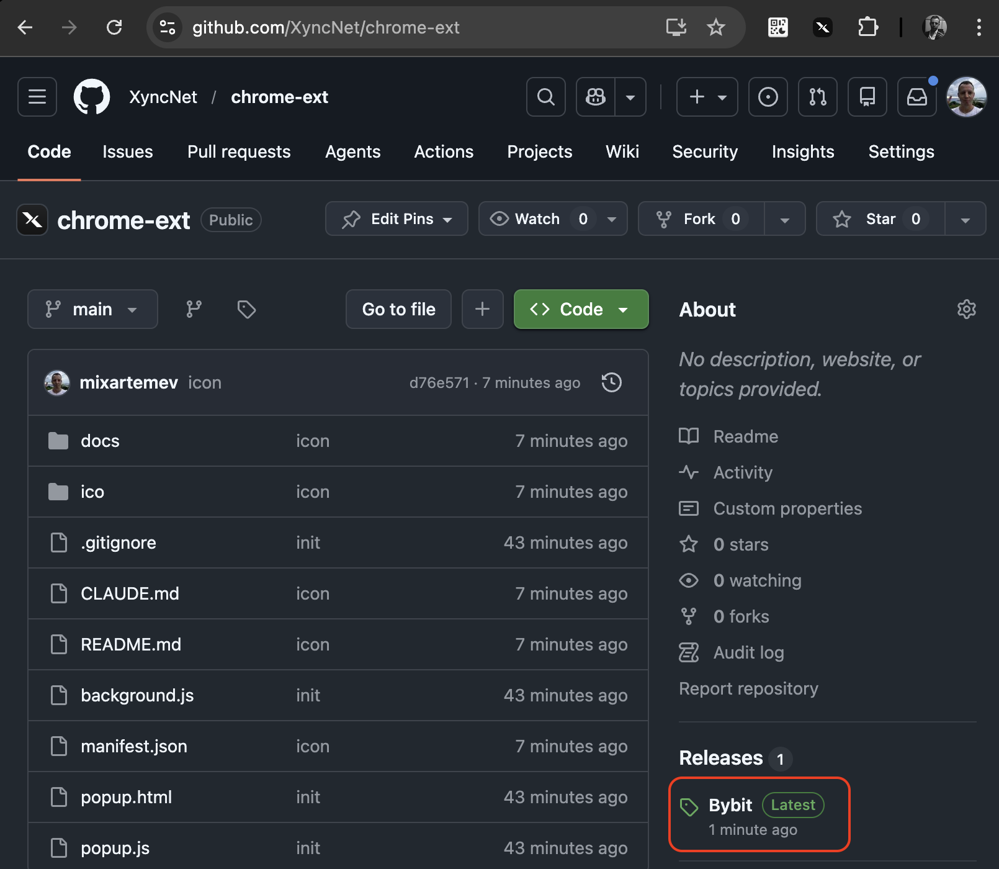
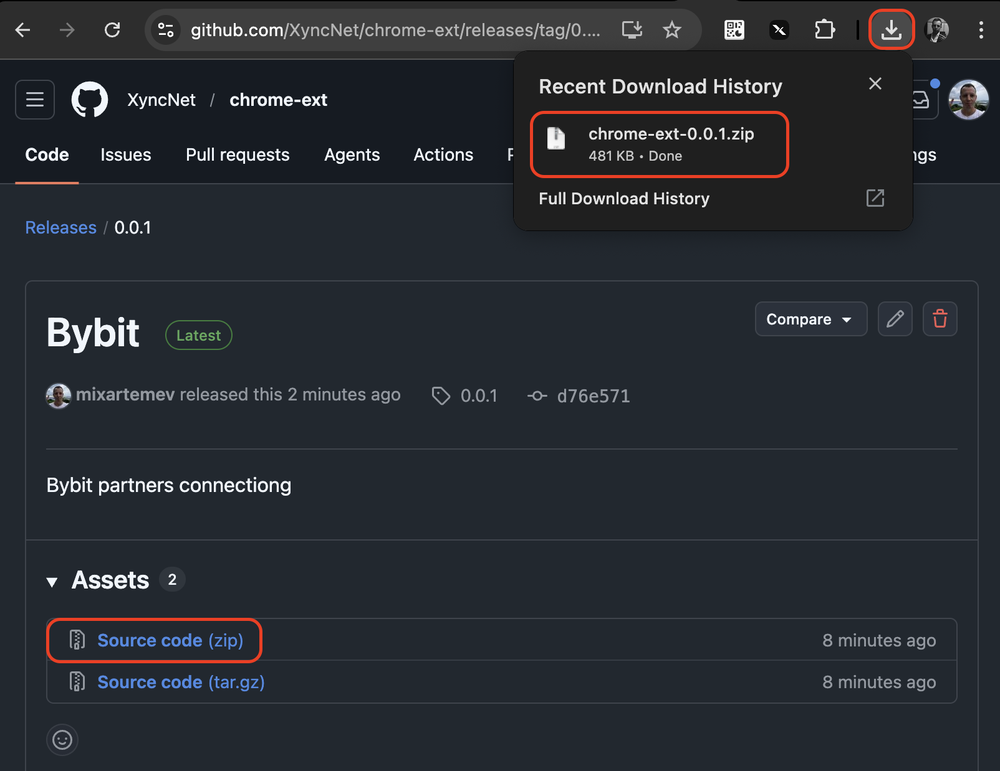
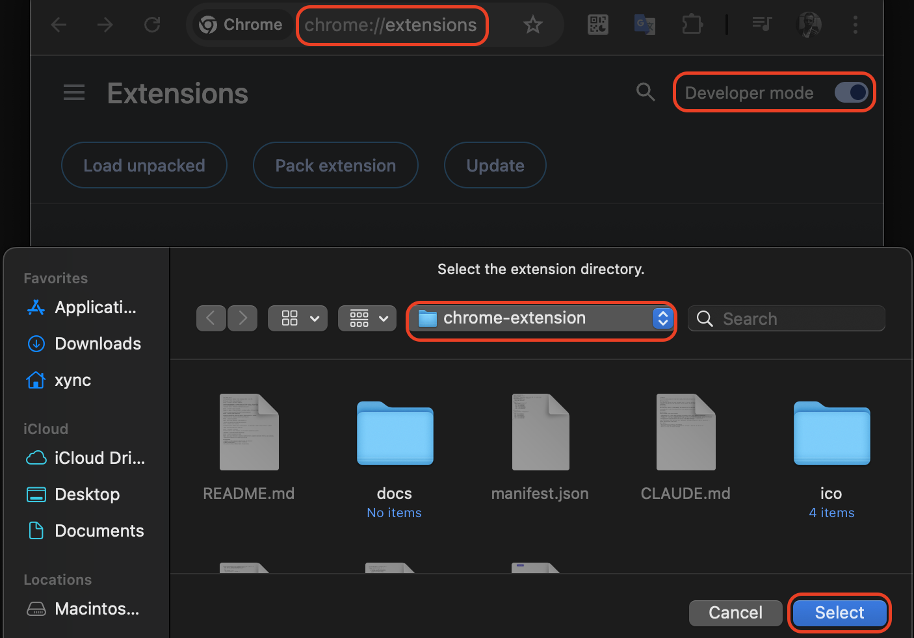
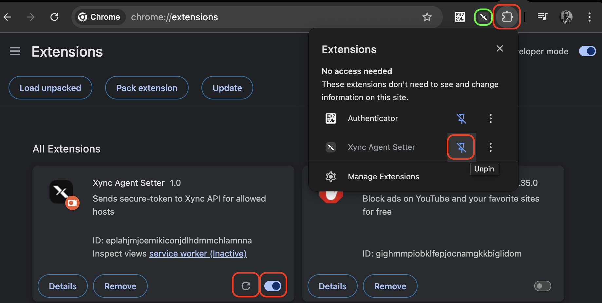

# Xync Agent Setter

Chrome-расширение для партнёров Xync: предоставить Xync-боту временное управление собственным аккаунтом Bybit или HTX.

## Установка в Chrome (режим разработчика)

### Шаг 0. Скачайте и распакуйте расширение

Скачайте архив расширения со страницы релизов на GitHub: **Code → Download ZIP** (или [прямая ссылка](https://github.com/USERNAME/REPO/archive/refs/heads/main.zip)). Распакуйте архив в любую удобную папку.

### Шаг 1. Откройте страницу расширений

Перейдите по адресу `chrome://extensions` или откройте **Menu → Extensions → Manage Extensions**.

### Шаг 2. Включите режим разработчика

Активируйте переключатель **Developer mode** в правом верхнем углу страницы.

### Шаг 3. Загрузите расширение

Нажмите кнопку **Load unpacked** в левом верхнем углу.

### Шаг 4. Выберите папку расширения

В открывшемся диалоге выберите папку `chrome-extension` (эту директорию) и нажмите **Select Folder** / **Open**.

### Шаг 5. Расширение установлено

Расширение появится в списке. Убедитесь, что оно включено (переключатель активен).

### Шаг 6. Закрепите расширение на панели

Нажмите иконку пазла (Extensions) на панели инструментов Chrome и закрепите **Xync Agent Setter**, нажав на булавку.

## Использование

1. Войдите в свой аккаунт на [bybit.com](https://www.bybit.com) или [htx.com](https://www.htx.com).
2. На HTX дополнительно откройте раздел P2P/OTC — это нужно, чтобы расширение перехватило подписанный запрос профиля.
3. Нажмите на иконку расширения на панели инструментов.
4. Нажмите кнопку отправки. При успехе отобразится статус и, если применимо, дата истечения.
5. Если backend запросит API-ключи (key / secret / 2FA) — введите их в появившиеся поля и нажмите ещё раз.
